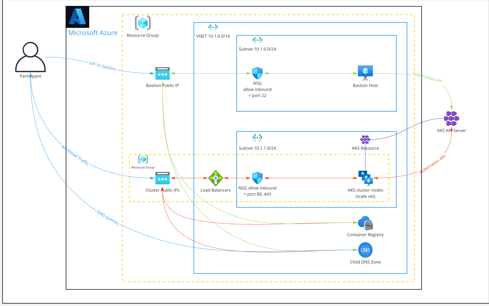
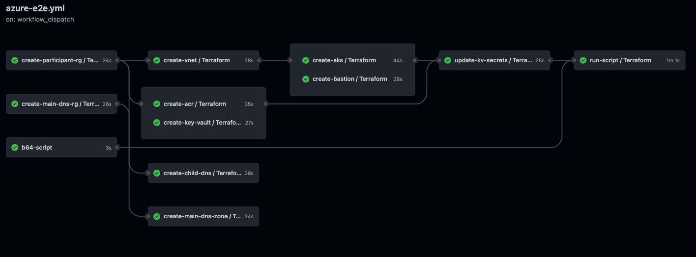

# Azure Automation for Tanzu Application Platform

## Benefits

This repository provides automation targeting [Azure](https://azure.microsoft.com/en-us/overview/what-is-azure/).


## What does it do?

It provisions the minimum set of cloud resources needed to begin installing Tanzu Application Platform on Azure.

Here's what you'll get:




## Prerequisites

### Fork this repository

You will want to fork this GitHub repository and enable the GitHub Actions it contains.

### Increase Azure Quotas

There are a few Azure subscription default quotas that will need to be adjusted.

1. Regional vCPU quota - In the Azure portal, navigate to the Subscription and on the left pane select `Usage + Quotas` > `Total Regional vCPUs` and set to 25.
2. Family vCPU quota - You will also need to increase the quota for the family of vCPUs you'll be using for cluster nodes.  Example: if you plan to use the `Standard_D4_v3` vCPU type, you'll need to increase the  `Standard Dv3 Family vCPUs` quota.  Whichever family of vCPU you choose, also set the quota to 25.
3. IP Addresses - You may also need to increase:  `Public IP Addresses - Standard`, `Public IP Addresses - Basic`, and `Static Public IP Addresses`.  These will require opening a service ticket that is usually resolved within an hour.  Set these quotas to 30.

> Note:  The above quotas will be enough to deploy the infrastructure needed for installing TAP.  Individual mileage may vary depending on existing resources.

### Setup an Azure service principal

First, log into Azure.
```
az login
```

Then set the needed environment variables.

```
export AZURE_SUBSCRIPTION_ID=<your_subscription_id>
export AZURE_SP_NAME=<name_of_sp_to_create>
export AZURE_SP_ROLE=<role_to_use>
```
Then run the following script found [here](./scripts/create-azure-service-principal.sh).
```
./scripts/create-azure-service-principal.sh
```
> In this case we use the `Owner` role. This is needed to manage RBAC. Also note that for the SP to work with the Github Actions using the Azure CLI, the `--sdk-auth` flag which is deprecated is still needed.  This is due to how the Github Action functions.

The output of this script will be a JSON block of credentials to be used in the following steps.
> Note: Store the output of the service principal creation securely. It contains credentials with elevated permissions within your subscription.

### Setup a Personal Access Token in Github

A PAT is required so that workflows can add secrets to the repository in order to be used in downstream jobs.  Documentation can be found [here](https://docs.github.com/en/authentication/keeping-your-account-and-data-secure/creating-a-personal-access-token).

> We are using this personal access token to create secrets for the `azurerm` backend for Terraform

### Configure Github Secrets

Setup some Github secrets with the SP credentials.  Documentation can be found [here](https://docs.github.com/en/actions/security-guides/encrypted-secrets).

```
PA_TOKEN - This is a personal access token that was created in an above step that allows for the workflows to write secrets.
AZURE_AD_CLIENT_ID – Will be the service principal ID from above `appId`
AZURE_AD_CLIENT_SECRET – The secret that was created as part of the Azure Service Principal `password`
AZURE_AD_TENANT_ID – The Azure AD tenant ID to where the service principal was created
AZURE_SUBSCRIPTION_ID – Subscription ID of where you want to deploy the Terraform
AZURE_CREDENTIALS - Paste the entire contents of the SP json that was output from the script above here. This is needed for the azurelogin Github Action.
AZURE_REGION - Required for setting up the storage accounts for managing Terraform state (e.g., `eastus2`)
```

### Setup the Terraform backend in Azure

Under Github Actions, manually trigger [Setup Terraform Backend in Azure](../../actions/workflows/setup-azure-provided-remote-backend.yml).

> See [setup-azure-provided-remote-backend.yml](.github/workflows/setup-azure-provided-remote-backend.yml)


### Create Shared Image Gallery, Image Definition, and Toolset Image

Under Github Actions, manually trigger [Build Ubuntu 20.04 VM Image on Azure](../../actions/workflows/azure-ubuntu-20_04.yml).

> Record or remember the resource group name you specify in this action as you will need it in later steps.

Alternatively, you could create the gallery, image definition, and image by executing the az CLI and Packer script by following these guides:

* [Build](packer/azure/ubuntu/20_04/BUILD.md)
* [Test](packer/azure/ubuntu/20_04/TEST.md)


## How do I use this?

### Fast path



Take this path when you want to get up-and-running as quickly as possible with the least amount of fuss.

Under Github Actions, manually trigger [Create Workshop Environment (targeting Azure)](../../actions/workflows/azure-e2e.yml)

* The DNS Zone name must be a domain you control and can configure nameservers for
* VM types can be found [here](https://docs.microsoft.com/en-us/azure/virtual-machines/sizes) - `Standard_D4_v3` is a good option
* Reference the resource group created in [above step](#-create-shared-image-gallery-image-definition-and-toolset-image).

### Slow path

Administer resources one at a time.  Take this path when you want to take a closer look at the GitHub Actions and Terraform modules.

There are two types of actions defined, those that can be manually triggered (i.e., dispatched), and those that can only be called by another action.  All actions are located [here](../../actions) and can be run by providing the required parameters.  Go [here](.github/workflows) to inspect the source for each action.

> Note that for most dispatch actions, you have the option to either create or destroy the resources.

#### Modules

| Module       | Github Action       | Terraform               |
| :---       | :---:               | :---:                   |
| Resource group |[:white_check_mark:](../../actions/workflows/azure-resource-group-dispatch.yml) | [:white_check_mark:](terraform/azure/resource-group) |
| If your environment will be multi-tenant and you want to maintain separation of control between participants and their associated child DNS domains, create a resource group for the parent DNS zone separately from the rest of the resources.||
| Key Vault | [:white_check_mark:](../../actions/workflows/azure-keyvault-dispatch.yml) | [:white_check_mark:](terraform/azure/keyvault) |
| Key Vault Secrets | [:white_check_mark:](../../actions/workflows/azure-keyvault-secrets.yml) | [:white_check_mark:](terraform/azure/keyvault-secrets) |
| DNS Zone for main domain | [:white_check_mark:](../../actions/workflows/azure-main-dns-dispatch.yml) | [:white_check_mark:](terraform/azure/main-dns) |
| DNS Zone for sub domain | [:white_check_mark:](../../actions/workflows/azure-child-dns-dispatch.yml) | [:white_check_mark:](terraform/azure/child-dns) |
| Virtual Network | [:white_check_mark:](../../actions/workflows/azure-virtual-network-dispatch.yml) | [:white_check_mark:](terraform/azure/virtual-network) |
| AKS Cluster | [:white_check_mark:](../../actions/workflows/azure-k8s-cluster-dispatch.yml) | [:white_check_mark:](terraform/azure/cluster) |
| Container registry | [:white_check_mark:](../../actions/workflows/azure-container-registry-dispatch.yml) | [:white_check_mark:](terraform/azure/registry) |
| Bastion | [:white_check_mark:](../../actions/workflows/azure-bastion-dispatch.yml) | [:white_check_mark:](terraform/azure/bastion) |


## Vending credentials

All Credentials are stored in Azure Key Vault. There is a KV per resource group (participant) where the credentials are stored that are specific to resources created for that participant (see architecture diagram).

There is only one credential that needs to be pulled down to get started, all other credentials will be accessible from the bastion host. This credential is the private ssh key for the bastion host. If you are the workshop owner and working in a multi-tenant environment you will need to hand this credential out to each participant. From there each participant will be able to access everything they need from the bastion host.

First, log into Azure using the service principal you created earlier.
```
az login --service-principal -u <clientID> -p <clientSecret> --tenant <tenantId>
```

Then, run the script to pull down all private keys along with the IP address of the bastion that it is associated with. This will create a folder `workshop-sshkeys` and loop over each resource group that matches `participant-x` it will then get the bastion IP and the ssh key from vault and write a file out into the directory with SSH key in it and ip in the name (e.g, `participant-x-bastion.172.16.78.9.pem`).

```
./scripts/fetch-ssh-key.sh
```

Once you ssh to the vm there will be credentials for the ACR registry in the home directory in files called `acr-user` and `acr-password` there will also be a kubeconfig in the home directory as well as it has been added under `~/.kube/config`.


## Cleaning up everything

In order to destroy all of the resources created you can use the github action [Destroy a participant's Workshop Environment (targeting Azure)](../../actions/workflows/azure-e2e-destroy.yml).  This action should be run with th same inputs used to create an environment. If this is multi-tenant you will want to run this once for each tenant. Additionally there is an option to clean up core components this is defaulted to `no` only choose yes if you are destroying all tenant environments since this will destroy the main DNS resource group as well as the Shared Image Gallery.